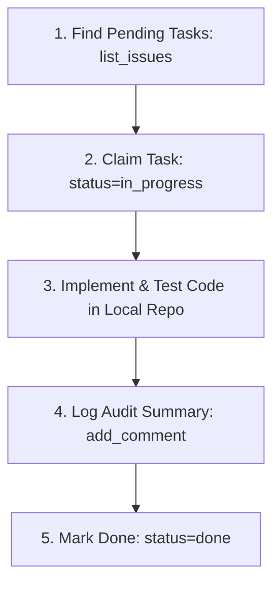

# ⚡ ProjectBase

<div align="center">

[](https://opensource.org/licenses/MIT)
[](https://pocketbase.io/)
[](https://vuejs.org/)
[](https://tailwindcss.com/)
[](https://scalar.com/)
[](https://github.com/jlowin/fastmcp)

**The ultra-lightweight, high-performance Plane & Linear alternative for multi-project Kanban, sprint cycles, and autonomous AI agent workflows.**

*Runs on ~16 MB RAM • Single Binary • Zero Build Step • Real-time SSE • Instant SQLite*

[Features](#-key-features) • [Quick Start](#-quick-start) • [Docker](#-docker) • [Agent Integration](#-ai-agent--mcp-integration) • [API & Docs](#-openapi--scalar-documentation) • [Architecture](#-architecture)

</div>

---

## 🚀 Key Features

- **⚡ Ultra-Low Footprint**: Consumes only **~16 MB RAM** in production (compared to 2,700 MB on Plane CE). Instant cold starts in <50ms.
- **✨ Zero-Build Frontend**: Vanilla Vue 3 UMD + Tailwind CSS served straight out of `pb_public/`. Instant browser refreshes with zero `node_modules` overhead.
- **📋 Multi-Project & Sprints**: Manage multiple repositories/domains (`LOAD`, `IBR`, `PB`, `HOME`), timeboxed Sprint Cycles, burndown progress, and custom labels.
- **🎯 Fluid Kanban & List Views**: Drag-and-drop card movements powered by SortableJS with real-time SSE sync across all open browser sessions and agent executions.
- **📝 Markdown Drawer & Subtasks**: Full markdown specification editor with live preview, interactive checklists, and audit logging comments.
- **🔍 Keyboard-First Command Palette**: Hit `⌘K` / `Ctrl+K` for instant global omnibar search, `C` for new tasks, and `1-6` for view switching.
- **🤖 Autonomous AI Agent Ready**: Native FastMCP server + REST endpoints + `pb-cli` for seamless integration with Cursor, Flomaster, Claude, and Hermes.
- **📖 Self-Documenting API**: Interactive modern Scalar UI at `/docs/`, raw OpenAPI 3.1 JSON at `/openapi.json`, and agent discovery prompt at `/llms.txt`.
- **⏰ Built-In Cron Automation**: Native Go cron engine (`cronAdd`) for automated sprint rollover and daily workspace velocity calculation.

---

## 🏛️ Architecture

```text
┌────────────────────────────────────────────────────────────────────────┐
│                   Zero-Build Vue 3 Single Page App                     │
│         Tailwind CSS • SortableJS • Lucide Icons • Marked.js           │
└───────────────────────────────────┬────────────────────────────────────┘
                                    │ SSE & REST (HTTP :8120)
┌───────────────────────────────────▼────────────────────────────────────┐
│                    PocketBase Backend Engine (Go)                      │
│     Auto-Migrations • Goja JS Hooks • FastMCP • Built-in Cron Engine   │
├────────────────────────────────────────────────────────────────────────┤
│                       SQLite Embedded Database                         │
└────────────────────────────────────────────────────────────────────────┘
```

---

## 📦 Quick Start

### Option A: Bare Metal / Local Binary (Recommended)

1. **Clone repository:**
   ```bash
   git clone https://github.com/AndrianBalanescu/projectbase.git
   cd projectbase
   ```

2. **Download PocketBase binary:**
   ```bash
   curl -sL https://github.com/pocketbase/pocketbase/releases/download/v0.39.11/pocketbase_0.39.11_linux_amd64.zip -o pb.zip
   unzip -o pb.zip pocketbase && chmod +x pocketbase && rm -f pb.zip
   ```

3. **Start the server:**
   ```bash
   ./scripts/start.sh
   # Or using make:
   make start
   ```

4. **Access the App:**
   - Web App & Live Kanban: [http://localhost:8120](http://localhost:8120)
   - Interactive Scalar Docs: [http://localhost:8120/docs/](http://localhost:8120/docs/)
   - PocketBase Admin Panel: [http://localhost:8120/_/](http://localhost:8120/_/)
     - Default Admin: `your configured admin credentials`

---

### Option B: Docker / Docker Compose

```bash
docker compose up -d
```

---

### Admin and User Accounts

`bootstrap.sh` intentionally requires explicit credentials. It never ships a usable public password:

```bash
ADMIN_EMAIL=you@example.com \
ADMIN_PASSWORD='generate-a-long-random-password' \
./scripts/bootstrap.sh
```

The admin account is for PocketBase administration only. Daily users belong to the `users` auth collection and sign in through the ProjectBase UI. Roles are `admin`, `manager`, `member`, and `agent`. Public deployments should put the app behind HTTPS, disable public registration unless intentionally enabled, and create normal user accounts rather than sharing the superuser.

## Demo Deployment Guidance

GitHub Pages can host a static project website, but it cannot run PocketBase, SQLite, SSE, or containers. Run the live demo on a small VPS/container with a persistent volume and HTTPS via Caddy or a managed reverse proxy. Keep the demo database isolated and resettable. Do not publish Homelab URLs, admin credentials, or private webhook endpoints.

---

## 🤖 AI Agent & MCP Integration

ProjectBase is designed ground-up for AI agents.

### FastMCP Configuration (Cursor, Flomaster, Claude, Hermes)

Add this block to your MCP configuration (`~/.cursor/mcp.json` or `~/.flomaster/config.json`):

```json
{
  "mcpServers": {
    "projectbase": {
      "command": "uv",
      "args": [
        "run",
        "/absolute/path/to/projectbase/scripts/mcp_server.py"
      ],
      "env": {
        "PROJECTBASE_URL": "http://localhost:8120"
      }
    }
  }
}
```

### 5-Step Autonomous Agent Loop



---

## 📡 OpenAPI & Scalar Documentation

- **Interactive API UI:** [http://localhost:8120/docs/](http://localhost:8120/docs/)
- **OpenAPI 3.1 Spec:** [http://localhost:8120/openapi.json](http://localhost:8120/openapi.json)
- **Agent Discovery Standard:** [http://localhost:8120/llms.txt](http://localhost:8120/llms.txt) and [http://localhost:8120/llms-full.txt](http://localhost:8120/llms-full.txt)

---

## 📄 License

MIT © [Andrian Balanescu](https://github.com/AndrianBalanescu)
