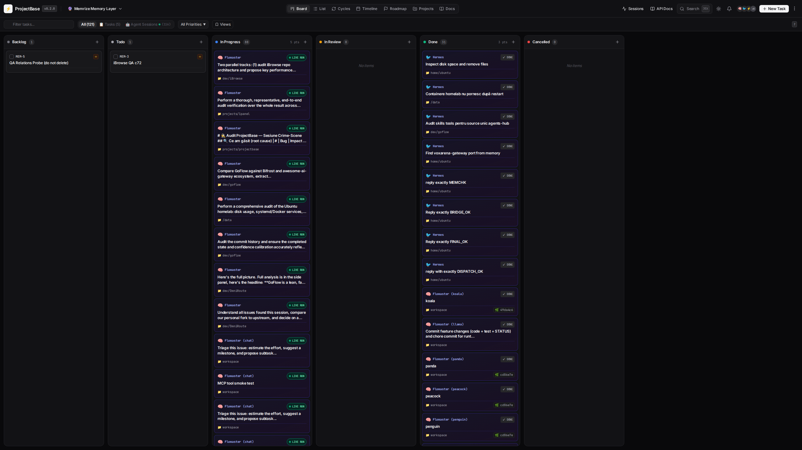
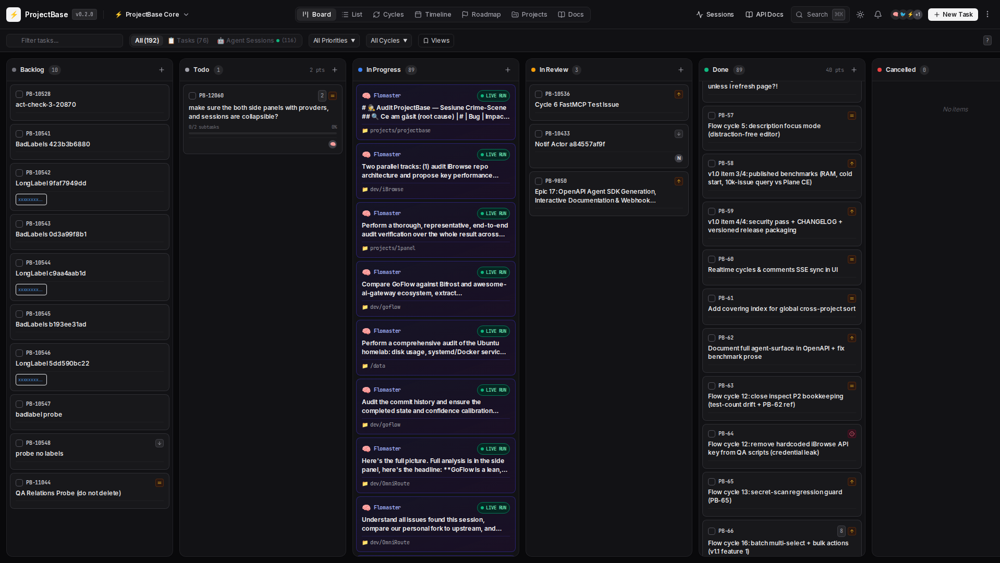
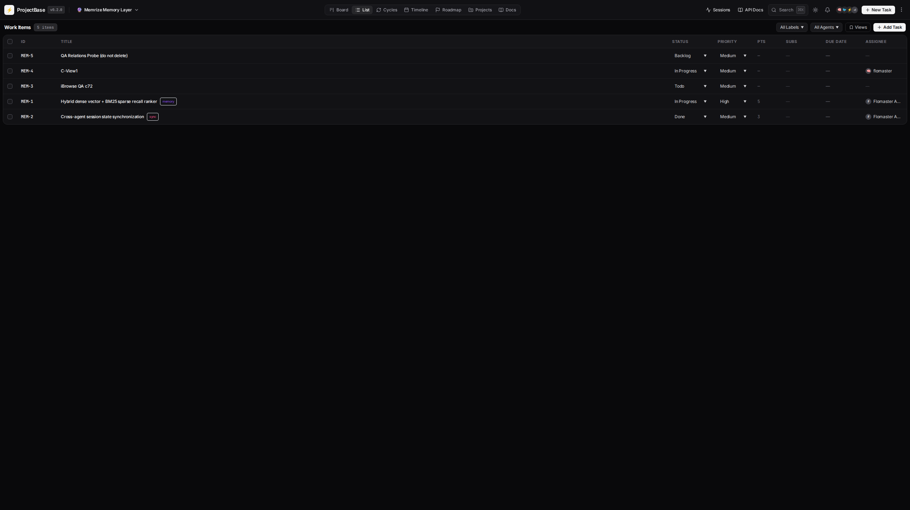
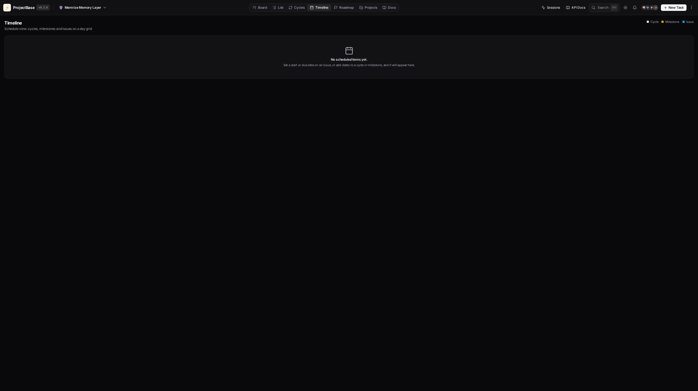
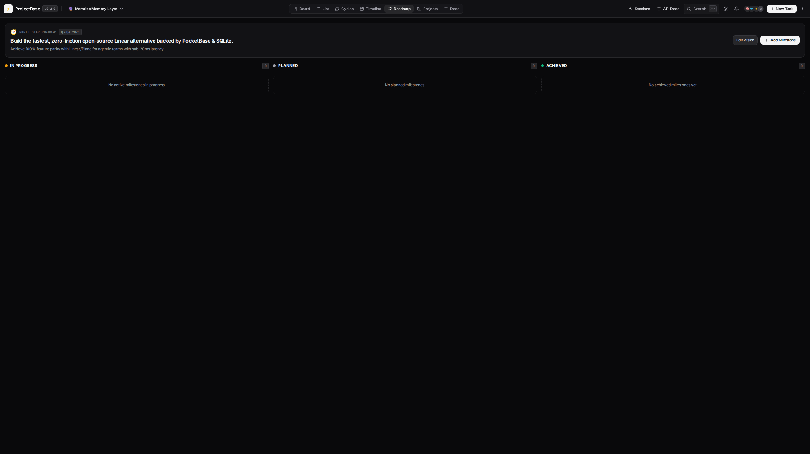
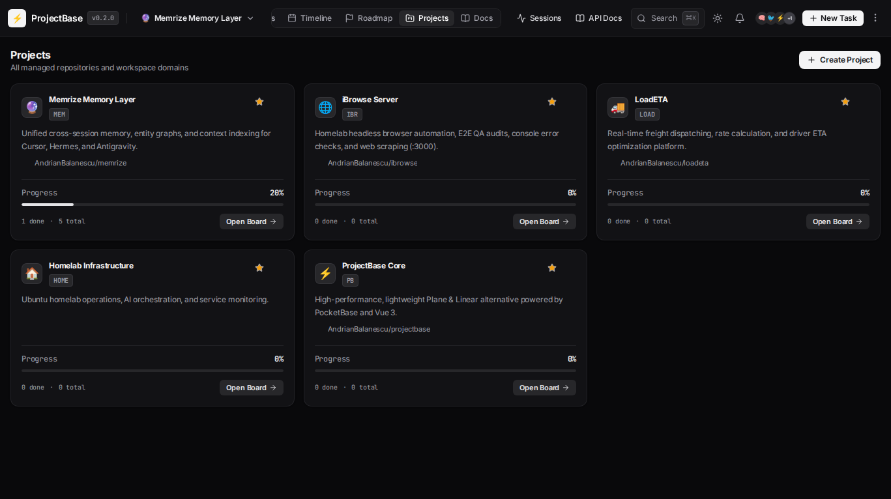
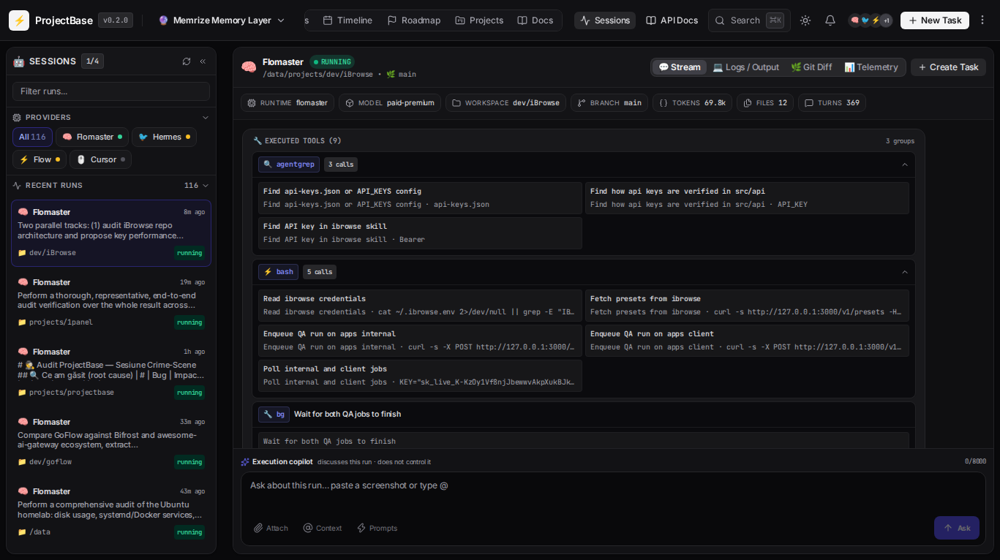
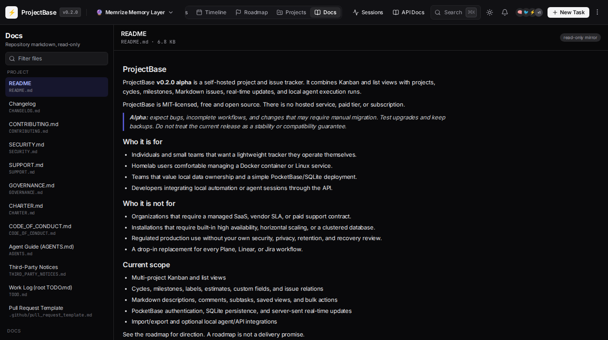
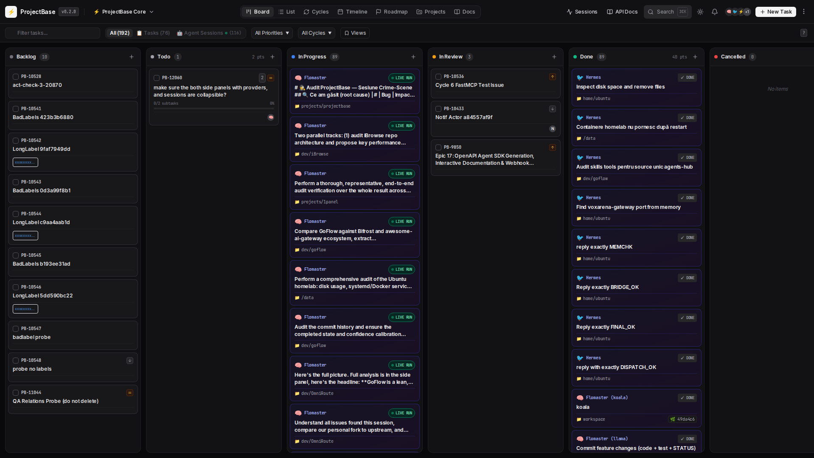

# ProjectBase

ProjectBase **v0.2.0 alpha** is a self-hosted project and issue tracker. It combines Kanban and list views with projects, cycles, milestones, Markdown issues, real-time updates, and local agent execution runs.

ProjectBase is MIT-licensed, free and open source. There is no hosted service, paid tier, or subscription.

> **Alpha:** expect bugs, incomplete workflows, and changes that may require manual migration. Test upgrades and keep backups. Do not treat the current release as a stability or compatibility guarantee.

## Who it is for

- Individuals and small teams that want a lightweight tracker they operate themselves.
- Homelab users comfortable managing a Docker container or Linux service.
- Teams that value local data ownership and a simple PocketBase/SQLite deployment.
- Developers integrating local automation or agent sessions through the API.

## Who it is not for

- Organizations that require a managed SaaS, vendor SLA, or paid support contract.
- Installations that require built-in high availability, horizontal scaling, or a clustered database.
- Regulated production use without your own security, privacy, retention, and recovery review.
- A drop-in replacement for every Plane, Linear, or Jira workflow.

## Current scope

- Multi-project Kanban and list views
- Cycles, milestones, labels, estimates, custom fields, and issue relations
- Markdown descriptions, comments, subtasks, saved views, and bulk actions
- PocketBase authentication, SQLite persistence, and server-sent real-time updates
- Import/export and optional local agent/API integrations

See the [roadmap](docs/ROADMAP.md) for direction. A roadmap is not a delivery promise.

## App Gallery & Main Views

| Kanban Board & Agent Runs | Resizable Issue Drawer |
| :---: | :---: |
|  |  |

| List View | Timeline / Gantt View |
| :---: | :---: |
|  |  |

| Sprint Cycles & Burndown | North Star Milestones |
| :---: | :---: |
|  |  |

| Projects Overview | Autonomous Agent Sessions |
| :---: | :---: |
|  |  |

| Built-in Markdown Docs Viewer | Command Palette & Shortcuts |
| :---: | :---: |
|  |  |

## Install with Docker

Requirements: Git and Docker with Compose v2. The checked-in Dockerfile currently downloads the Linux `amd64` PocketBase binary, so this image build supports **x86_64/amd64 hosts only**.

```bash
git clone https://github.com/AndrianBalanescu/ProjectBase.git
cd ProjectBase
docker compose up -d --build
```

Open <http://localhost:8120/_/> to create the first PocketBase superuser, then use <http://localhost:8120/>.

Runtime data is persisted in `app/pb_data/`. The Compose file also bind-mounts `app/pb_public/`, `app/pb_hooks/`, and `app/pb_migrations/` from the checkout. Review changes before pulling and back up before rebuilding or upgrading.

To use another host port:

```bash
PROJECTBASE_PORT=9000 docker compose up -d --build
```

## Supported platforms

| Method | Platforms represented by this repository |
|---|---|
| Docker Compose | Linux containers on x86_64/amd64 |
| Native installer | Linux and macOS on x86_64, arm64, or armv7 where PocketBase publishes the matching archive |
| systemd helper | Linux with systemd |

The native path requires `bash`, `curl`, and `unzip`:

```bash
./scripts/install.sh
ADMIN_EMAIL=you@example.com \
ADMIN_PASSWORD='use-a-long-random-password' \
./scripts/bootstrap.sh
```

The bootstrap command starts ProjectBase on `127.0.0.1:8120`. For ordinary native launches, use `./scripts/start.sh`; it honors `PROJECTBASE_HOST` and `PROJECTBASE_PORT`.

Windows is not covered by the repository's installer or service scripts. Docker may work through a compatible Docker environment, but it is not documented here as a tested platform.

## Production configuration

ProjectBase does not provide a hardened production profile. Before exposing it beyond a trusted network:

1. Create a unique, long PocketBase superuser password and store it outside the repository.
2. Keep port 8120 private. Terminate HTTPS at a reverse proxy. Examples are provided in [`deploy/Caddyfile`](deploy/Caddyfile) and [`deploy/projectbase.service`](deploy/projectbase.service); adapt their domain, user, paths, and permissions.
3. Restrict filesystem access to the checkout and especially `app/pb_data/`. Never commit that directory.
4. Set explicit environment variables for integrations you enable, following the relevant script or integration documentation. Do not put secrets in tracked files.
5. Back up and test restoration before upgrades. Pin the revision you deploy instead of following `main` blindly.
6. Review PocketBase's own production guidance. ProjectBase inherits PocketBase and SQLite operational constraints.

The provided `scripts/install-systemd.sh` is an example for a Linux host. Read it before running it because it installs files under `/opt/projectbase` and a system service.

## Backup and restore

The backup helper authenticates as a PocketBase superuser, asks the running instance to create a snapshot, downloads and verifies the ZIP, and removes that temporary server-side copy. Pass credentials explicitly or through `PB_SUPERUSER_EMAIL` and `PB_SUPERUSER_PASSWORD`:

```bash
./scripts/backup.sh \
  --url http://127.0.0.1:8120 \
  --email you@example.com \
  --password 'your-password' \
  --out ./backups \
  --keep 14
```

Restore is destructive and requires the service to be stopped. It validates the archive, replaces the target data directory, and keeps the previous directory as a timestamped rollback copy:

```bash
docker compose stop projectbase
./scripts/restore.sh ./backups/projectbase-YYYYMMDD-HHMMSS.zip \
  --data-dir ./app/pb_data \
  --force
docker compose up -d projectbase
curl -fsS http://127.0.0.1:8120/api/projectbase/health
```

Read [`scripts/backup.sh`](scripts/backup.sh) and [`scripts/restore.sh`](scripts/restore.sh) before relying on them. Store backup copies away from the application host and periodically perform a test restore.

## Known limitations

- The project is alpha and does not promise backward compatibility yet.
- The standard deployment is one PocketBase process backed by SQLite. No clustering or built-in failover is supplied.
- Docker image builds are currently amd64-only.
- Operational security, TLS, monitoring, off-host backups, and disaster recovery remain the operator's responsibility.
- Some integrations require additional credentials or locally running services and are not configured by default.
- Performance depends on hardware, dataset, workload, and deployment topology.

## Benchmarks

Measured results, environment, dataset construction, commands, and caveats are documented in [`docs/BENCHMARKS.md`](docs/BENCHMARKS.md). The harness is [`scripts/bench/bench.py`](scripts/bench/bench.py). Treat the published run as one reproducible local measurement, not a universal performance guarantee or a third-party comparison.

## Contributing and support

Read [CONTRIBUTING.md](CONTRIBUTING.md), [SUPPORT.md](SUPPORT.md), and [GOVERNANCE.md](GOVERNANCE.md). Report security issues privately as described in [SECURITY.md](SECURITY.md). Participation is governed by the [Code of Conduct](CODE_OF_CONDUCT.md).

## License and third-party software

ProjectBase is licensed under the [MIT License](LICENSE). Bundled browser dependencies retain their own licenses; see [THIRD_PARTY_NOTICES.md](THIRD_PARTY_NOTICES.md).
