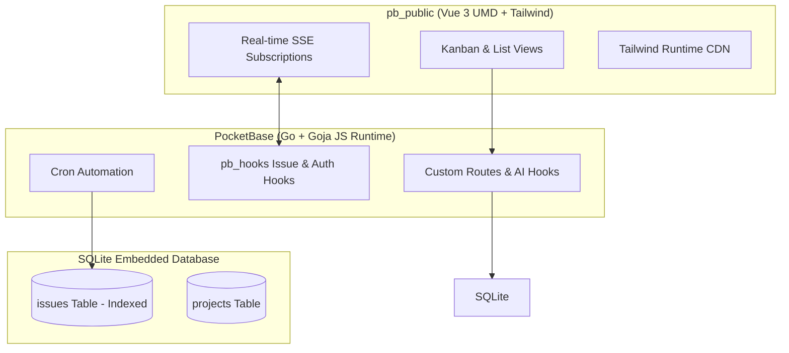
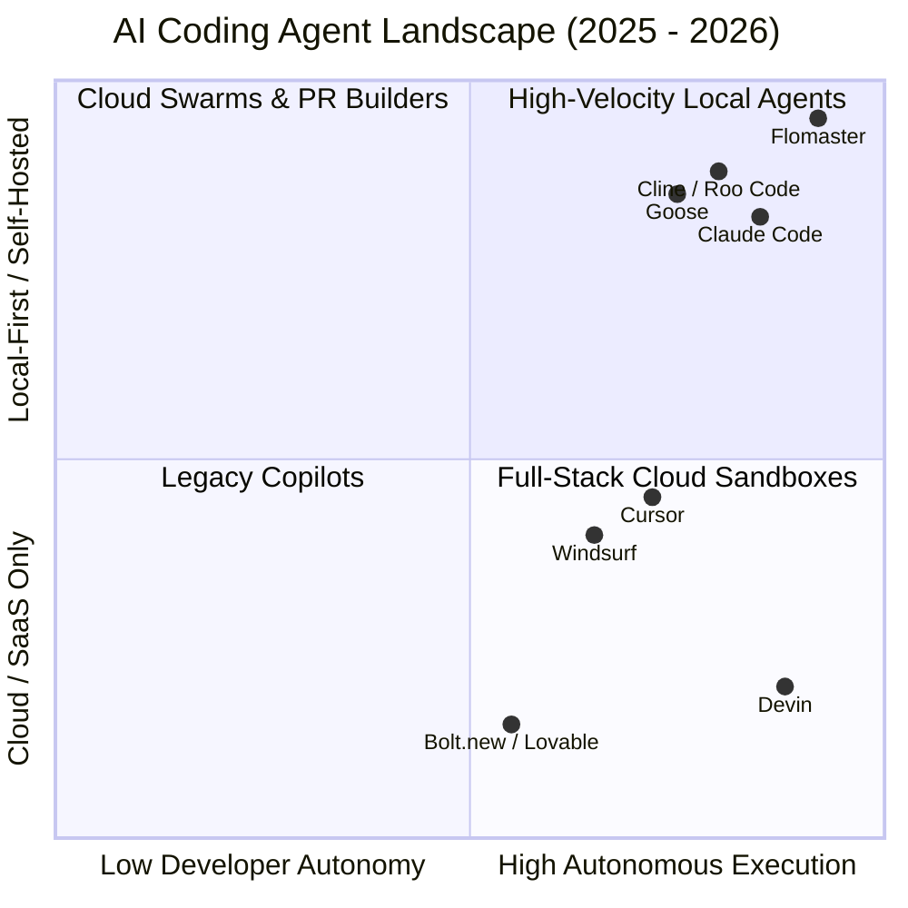

# Repository Architecture Audit & AI Coding Agent Competitive Landscape

## Executive Summary

This document presents the system architecture audit, performance optimization roadmap, and 2025/2026 competitive landscape analysis for ProjectBase and the broader AI coding agent ecosystem.

---

## 1. Repository Architecture Audit & Performance Optimizations

### Database & Storage Tier
- **Issue Indexing**: The `issues` collection previously lacked composite indexes, causing queries ordered by issue number or order to execute full table scans with temporary in-memory B-trees.
- **Implemented Optimization**: Added migration `1710000008_performance_indexes.js` introducing composite indexes:
  - `idx_issues_project_order`: on `issues (project, "order", created)`
  - `idx_issues_project_number`: on `issues (project, issue_number DESC)`
  - `idx_issues_project_status`: on `issues (project, status)`
  - `idx_issues_cycle`: on `issues (cycle)`
  - `idx_issues_milestone`: on `issues (milestone)`
  - `idx_comments_issue_created`: on `comments (issue, created)`
  - `idx_cycles_project_status`: on `cycles (project, status)`
  - `idx_milestones_project_status`: on `milestones (project, status)`
  - `idx_activity_project_created`: on `activity (project, created DESC)`
  - `idx_activity_issue_created`: on `activity (issue, created DESC)`
- **Mechanical Proof**: SQLite `EXPLAIN QUERY PLAN` confirmed queries transitioned from `SCAN issues` and `USE TEMP B-TREE FOR ORDER BY` to direct index searches (`SEARCH issues USING INDEX idx_issues_project_number`).

### Hook & In-Memory Runtime Tier
- **Goja Allocation Overhead**: Endpoints like `/api/projectbase/stats` (`pb_hooks/30_custom_routes.pb.js`) and cron jobs (`pb_hooks/50_cron_automation.pb.js`) read up to 1,000 full records into JavaScript memory to compute metrics.
- **Recommended Optimization**: Replace JavaScript iteration with direct SQLite SQL aggregations (`$app.db().select("status, count(id) as total").from("issues").groupBy("status")`) to eliminate Goja object allocation overhead.

### Frontend Rendering & Asset Optimization
- **Tailwind Runtime Footprint**: Loading `vendor/tailwindcss.js` (over 3 MB uncompressed) forces the client browser to parse DOM nodes on every mutation.
- **Recommended Optimization**: Compile a static minified CSS bundle with the Tailwind CLI to eliminate client runtime DOM parsing and reduce page payload.
- **DOM Icon Hydration**: `KanbanBoardComponent` and `ListViewComponent` invoked `lucide.createIcons()` on every Vue `updated()` lifecycle event, traversing the entire DOM repeatedly.
- **Recommended Optimization**: Scope icon creation to updated element containers or convert icons to inline SVG components.
- **Kanban Column Partitioning**: Pre-compute column-partitioned lists in a single computed property (`columnsWithIssues`) instead of filtering in render methods.

### Network & Real-Time Sync
- **Scoped Subscriptions**: Scope real-time SSE subscriptions in `api.js` to active project identifiers rather than subscribing to global wildcard collections.
- **Static Caching**: Configure immutable caching headers in `deploy/Caddyfile` for vendor libraries.

---

## 2. Competitive Landscape: AI Coding Agents on ProductHunt & X

### Major Market Competitors
1. **Cursor (Anysphere)**: Transitioned from an editor extension to an agent workspace. Introduced *Origin* for agent-native code hosting and collaborative review.
2. **Claude Code (Anthropic)**: High-speed terminal CLI agent optimized for deterministic git workflows, fast codebase navigation, and low token overhead.
3. **Cline & Roo Code**: Leading open-source VS Code extensions on ProductHunt and GitHub. Popularized Model Context Protocol (MCP) tool integration and human-in-the-loop permission gates.
4. **Devin & OpenDevin / All-Hands AI**: Autonomous cloud software engineers focusing on end-to-end issue reproduction, background PR generation, and task board intake.
5. **Flomaster / Pi / Aider**: Ultra-lightweight, local-first CLI and terminal agents focusing on instant loop feedback, minimal memory overhead, and multi-model routing.

### Key Industry Trends & Developer Sentiments
1. **Universal Adoption of MCP**: Model Context Protocol has become the standard integration layer across modern agents, replacing proprietary plugin interfaces.
2. **Preference for Low-Latency, Local-First Execution**: Developers heavily favor lightweight local tools with small memory footprints over resource-heavy containers and high-latency cloud round trips.
3. **Shift to Closed-Loop Verification**: Conversational chat interfaces have lost ground to agents capable of executing tests, inspecting failures, and autonomously committing validated diffs.
